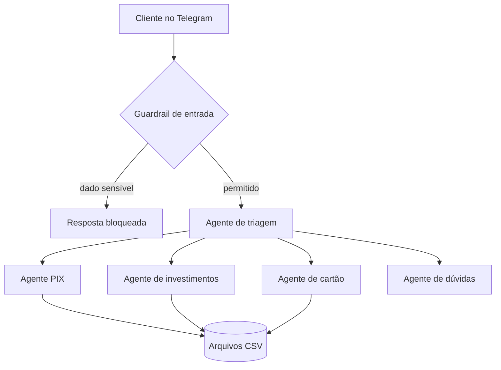

# Banco CP5 — Assistente Bancário Multiagente

[🇬🇧 English](README.md) | 🇧🇷 Português

Banco digital simulado em que agentes de IA cuidam de PIX, investimentos e cartão de crédito pelo Telegram.

> Banco fictício criado em um projeto acadêmico da FIAP. Sem vínculo com nenhuma instituição financeira real. Todos os dados são de teste.

## Demonstração

- Vídeo: [coloque aqui o link do YouTube (não listado)]

### Comprovante de PIX e extrato da conta

| Comprovante de PIX | Extrato da conta |
|---|---|
|  |  |

## Arquitetura



- O agente de triagem encaminha cada mensagem a um especialista, exposto a ele como ferramenta
- Os especialistas respondem só com o retorno das tools, sem calcular saldos "de cabeça"
- Memória de conversa por usuário do Telegram com `SQLiteSession`

## Agentes e tools

| Agente | Tools |
|---|---|
| PIX | `consultar_saldo`, `consultar_extrato`, `consultar_historico_pix`, `listar_contatos`, `buscar_contato`, `adicionar_contato`, `realizar_pix` |
| Investimentos | `consultar_saldo`, `consultar_investimentos`, `aplicar_investimento`, `resgatar_investimento` |
| Cartão de crédito | `consultar_cartao_credito` |
| Dúvidas | apenas instruções (dúvidas gerais sobre produtos) |

## Regras de negócio

- CDB Baixa Automática e Poupança cobrem o PIX automaticamente quando o saldo em conta não basta
- CDB DI não tem baixa automática: o dinheiro só volta para a conta com um resgate
- Aplicar usa o saldo da conta; resgatar devolve o dinheiro para a conta
- Não existe depósito externo, nem na conta nem nos investimentos
- Cartão de crédito: mostra só o valor pré-aprovado; a contratação é SOMENTE pelo app do banco, por segurança
- Guardrail de entrada bloqueia pedidos com senha, CPF, número do cartão ou CVV
- Comprovantes de PIX e extratos são gerados em imagem e enviados no Telegram
- Toda movimentação é registrada (PIX, aplicações, resgates e baixas automáticas)

## Stack

- Python, Google Colab
- OpenAI Agents SDK (`gpt-4o-mini`)
- python-telegram-bot
- pandas (persistência em CSV no Google Drive)
- Pillow (comprovantes e extratos)

## Arquivos de dados

| Arquivo | Conteúdo |
|---|---|
| `saldo.csv` | Saldo da conta |
| `investimentos.csv` | Valor investido por produto |
| `contatos_pix.csv` | Contatos salvos para PIX |
| `transacoes_pix.csv` | Histórico de PIX |
| `movimentacoes.csv` | Lançamentos do extrato |
| `cartao_credito.csv` | Valor pré-aprovado de cartão |

## Como rodar

1. Crie um bot com o [@BotFather](https://t.me/BotFather) e copie o token
2. Abra o `CP5_Banco_Multiagente.ipynb` no Google Colab
3. Adicione `OPENAI_API_KEY` e `TELEGRAM_BOT_TOKEN` nos Secrets do Colab
4. Execute todas as células de cima para baixo (a primeira execução cria os CSVs no Drive)
5. Troque para `RESETAR_BASE = False` para manter o saldo entre execuções
6. Envie `/start` para o seu bot no Telegram

## Exemplos de mensagens

```
Qual o meu saldo?
Faça um PIX de R$ 50 para a Ana
Para quem foi meu último PIX?
Quero aplicar R$ 5.000 no CDB DI
Me mostre o extrato
Qual o meu valor pré-aprovado de cartão?
```

## Limitações

- Um único cliente simulado
- Armazenamento em CSV, voltado ao aprendizado e não à produção
- Notebook voltado ao Colab, e o bot só funciona enquanto a sessão estiver ativa

## Autores

- Lucas Caram
- Mauricio Bertuci Saletti
- Nicolas Andrade Rodrigues
- Leonardo Fortini Marcelo
- Rhuan Pacheco Carreri