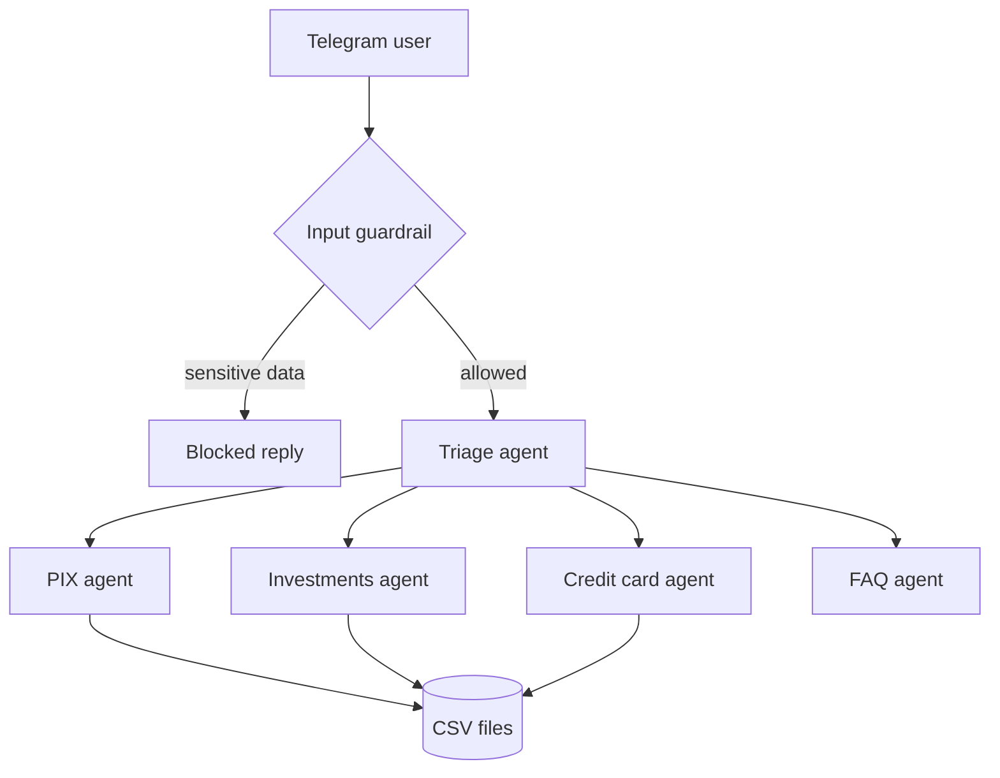

# CP5 Bank — Multi-Agent Banking Assistant

🇬🇧 English | [🇧🇷 Português](README.pt-BR.md)

Simulated digital bank where AI agents handle PIX, investments and credit card requests through Telegram.

> Fictional bank built for a university project at FIAP. Not affiliated with any real financial institution. All data is test data.

## Demo

- Video: [add the YouTube (unlisted) link here]

### PIX receipt and account statement

| PIX receipt | Account statement |
|---|---|
|  |  |

## Architecture



- Triage agent routes every message to a specialist, exposed to it as a tool
- Specialists answer only from tool results, never from "memory" of balances
- Conversation memory per Telegram user with `SQLiteSession`

## Agents and tools

| Agent | Tools |
|---|---|
| PIX | `consultar_saldo`, `consultar_extrato`, `consultar_historico_pix`, `listar_contatos`, `buscar_contato`, `adicionar_contato`, `realizar_pix` |
| Investments | `consultar_saldo`, `consultar_investimentos`, `aplicar_investimento`, `resgatar_investimento` |
| Credit card | `consultar_cartao_credito` |
| FAQ | instructions only (general product questions) |

## Business rules

- CDB Baixa Automática and Poupança cover a PIX automatically when the account balance is not enough
- CDB DI has no automatic redemption: the money only returns to the account through a redemption
- Investing uses the account balance; redemption returns the money to the account
- No external deposits into the account or into investments
- Credit card: only the pre-approved amount is shown; contracting happens ONLY in the bank's app, for security
- Input guardrail blocks requests mentioning password, CPF, card number or CVV
- PIX receipts and statements are generated as images and sent back on Telegram
- Every movement is recorded (PIX, investments, redemptions, automatic withdrawals)

## Stack

- Python, Google Colab
- OpenAI Agents SDK (`gpt-4o-mini`)
- python-telegram-bot
- pandas (CSV persistence on Google Drive)
- Pillow (receipts and statements)

## Data files

| File | Content |
|---|---|
| `saldo.csv` | Account balance |
| `investimentos.csv` | Amount invested per product |
| `contatos_pix.csv` | Saved PIX contacts |
| `transacoes_pix.csv` | PIX history |
| `movimentacoes.csv` | Statement entries |
| `cartao_credito.csv` | Pre-approved credit card amount |

## How to run

1. Create a bot with [@BotFather](https://t.me/BotFather) and get the token
2. Open `CP5_Banco_Multiagente.ipynb` in Google Colab
3. Add `OPENAI_API_KEY` and `TELEGRAM_BOT_TOKEN` to Colab Secrets
4. Run all cells from top to bottom (the first run creates the CSV files on Drive)
5. Set `RESETAR_BASE = False` to keep the balance between runs
6. Send `/start` to your bot on Telegram

## Example messages

```
Qual o meu saldo?
Faça um PIX de R$ 50 para a Ana
Para quem foi meu último PIX?
Quero aplicar R$ 5.000 no CDB DI
Me mostre o extrato
Qual o meu valor pré-aprovado de cartão?
```

## Limitations

- Single simulated customer
- CSV storage, meant for learning, not production
- Notebook is Colab-oriented, and the bot runs only while the session is alive

## Authors

- Lucas Caram
- Mauricio Bertuci Saletti
- Nicolas Andrade Rodrigues
- Leonardo Fortini Marcelo
- Rhuan Pacheco Carreri